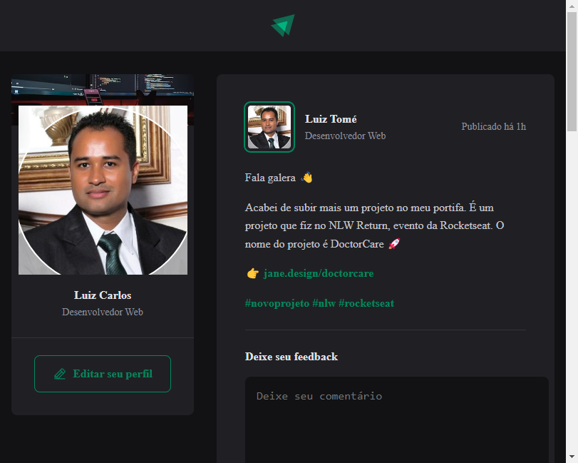

# 01-fundamentos-reactjs - Curso Rocketseat

Projeto construído na base de estudos Iginite do Rocketseat.

[🔗Clique aqui para acessar](https://luizctb.github.io/01-fundamentos-reactjs/)

## 🛠️ Tecnologias:

- Reacht
- JavaScript
- html
- CSS
- Vite
- Git / Github
- Figma

## ❤️ Contato:
luizcarlostb@hotmail.com
